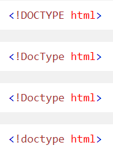

# World-Of-HTML5
All HTML tags and info. 
1.<!DOCTYPE> Declaration

- All HTML documents must start with a <!DOCTYPE> declaration.

- The declaration is not an HTML tag. It is an "information" to the browser about what document type to expect.

- In HTML 5, the declaration is simple:  
- **Tip:** The <!DOCTYPE> Declaration is NOT case sensitive
Examples:  

